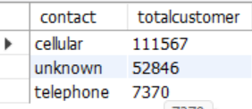
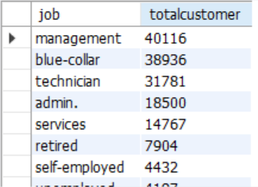

# Bank Marketing Financial Project
## Introduction
This project entails 250,001 records of bank marketing datasets. It contains customer demographic and financial information
along with details of past campaigns and identify the strength and weakness of the bank marketing campaigns over a period of time
## Business questions
1.	Customer Demographic and Segmentation
   
a.	Which age groups are more likely to respond positively to marketing campaigns?

b.	How does marital status or education level influence customer responses?

2.	Financial Insights
   
a.	Do customers with higher account balances respond more to campaigns compared to those with lower or negative balances?  

b.	Is there any relationship between loan or housing loan status and campaign success?

3.	Campaign Effectiveness

a.	What is the average campaign success rate across different job types?  

b.	How does the number of previous contacts (campaign, previous days) affect customer response?

4.	Communication Strategy
   
a.	Which contact method (cellular vs unknown) yields higher conversion rates?

b.	Does the duration of the last call significantly impact the probability of success?

5.	Predictive / Optimization Questions
   
a.	Can we predict whether a customer will subscribe to a product/service based on their demographics and past campaign history?

b.	What is the best combination of factors (age, job, balance, loan status) for identifying high-potential leads?

## Total Customer that used the bank 

the total number of customer that used our bank amounted to 171783

## Total customer with their marital status

the total number of customer based on marital status exploratory data analysis is as follow on mysql output

## Total Customer with their Customer Contact

the total number of customer based on contact exploratory data analysis is as follow on mysql output

## Total Customer with their Customer Education

the total number of customer based on education is as follow on mysql output

## Total customer with their customer housing

the total number of customer based on housing is as follow on mysql output

## Total customer with their customer job

the total number of customer based on job description is as follow on msysql output

## Total Customer with their loan

the total number of customer based on loan is as follow on mysql output

## Technology Used
this is sql project. a single query technique was used to run the query coupled with aggregate function which was then used to aggregate large rows of dat
into a small rows of data given the information we need

